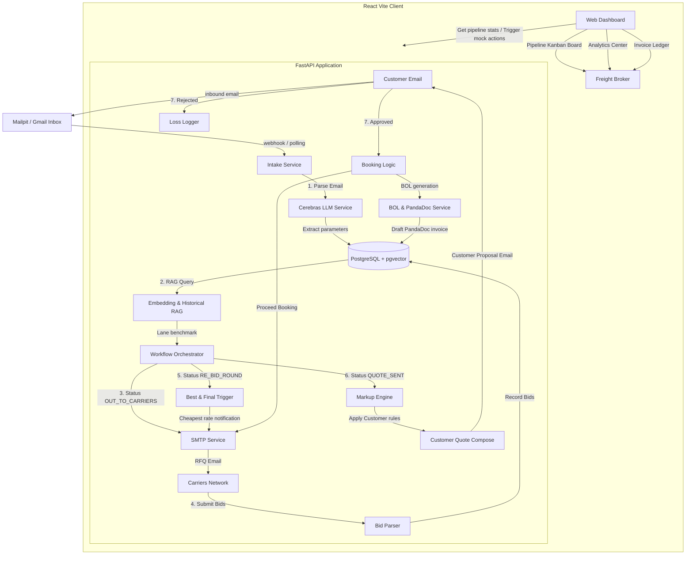

# AMZPrep Automated Freight Bidding Engine

An automated, competitive, time-bound carrier bidding and customer freight quoting platform designed to replace manual email workflows.

---

## 1. System Architecture

The following diagram illustrates the lifecycle of a freight quote, starting from an email intake request, parsing with Cerebras LLM, broadcasting carrier RFQs, triggers for the competitive re-bid round, markup calculation, and downstream document generation.



### Component Details
1. **Intake Service**: Extracts shipment fields (origin, destination, weight, class, hazmat, accessorials, date) from unstructured free-text emails using **Cerebras LLM (`llama3.1-70b`)**, with a robust regex-based backup parser.
2. **RAG Embedding Service**: Generates a deterministic 1536-dimensional unit vector representing the shipment lane. Performs a vector similarity search in **PostgreSQL (`pgvector`)** to pull historical pricing for similar lanes.
3. **Workflow Orchestrator**: Governs state transitions across the 10 stages: `INTAKE` -> `OUT_TO_CARRIERS` -> `FIRST_ROUND_RECEIVED` -> `RE_BID_ROUND` -> `QUOTE_SENT` -> `AWAITING_APPROVAL` -> `APPROVED` -> `IN_TRANSIT` -> `COMPLETED` -> `LOST`. Runs background timers for bidding windows.
4. **Markup Service**: Looks up customer default markup rules (e.g. Customer A: 5%, Customer B: 12%, Customer C: 30%) and calculates sell rates and gross margins.
5. **Billing & Reconciliation**: Generates simulated carrier BOL URLs and creates mock PandaDoc invoice drafts upon approval.
6. **Email Simulator (Mailpit)**: Intercepts all outgoing SMTP traffic. Exposes a mock email compose UI to easily test intake parsing and carrier bidding rounds.

---

## 2. Technology Stack

- **Backend**: Python 3.11, FastAPI, SQLAlchemy (ORM), Alembic (migrations), Redis (cache/polling), pgvector.
- **AI Inference**: Cerebras Cloud API (Llama-3.1-70b) for sub-second NLP extraction.
- **Frontend**: React 19, Vite, Lucide React (icons), Recharts (data visualizations), Axios.
- **Infrastructure**: Docker, Docker Compose, Mailpit (SMTP mockup server).

---

## 3. Development Setup

### Prerequisites
- Docker & Docker Compose
- Python 3.11+ (for local scripts/tests)
- Node.js 20+ (for local frontend development outside Docker)

### Environment Configuration
1. Copy the environment template:
   ```bash
   cp .env.example infra/.env
   ```
2. Edit `infra/.env` and supply your **Cerebras API Key** (optional, fallback to regex parsing applies automatically if omitted):
   ```env
   CEREBRAS_API_KEY=your_cerebras_key_here
   ```

### Running with Docker Compose (Recommended)
Spin up the database, cache, email mockup, backend, and frontend containers:
```bash
docker compose --env-file .env -f infra/docker-compose.yml up --build -d
```

Once running, access the following URLs in your browser:
- **Broker Web Dashboard**: [http://localhost:5173](http://localhost:5173)
- **SMTP Email Interceptor (Mailpit)**: [http://localhost:18025](http://localhost:18025)
- **FastAPI OpenAPI Document**: [http://localhost:8000/docs](http://localhost:8000/docs)

---

## 4. Local Development (No Docker)

If you prefer to run services outside of Docker:

### Backend Setup
1. Create and activate a Python virtual environment:
   ```bash
   cd backend
   python3 -m venv venv
   source venv/bin/activate
   ```
2. Install requirements:
   ```bash
   pip install -r requirements.txt
   ```
3. Run FastAPI application:
   ```bash
   uvicorn app.main:app --host 0.0.0.0 --port 8000 --reload
   ```

### Frontend Setup
1. Install node dependencies:
   ```bash
   cd frontend
   npm install
   ```
2. Run development server:
   ```bash
   npm run dev
   ```

---

## 5. Walkthrough: Simulating a Bid
1. Access the **Email Simulator** tab in the Dashboard.
2. Select **Template: Standard LTL (LA to Chicago)**. Click **Ingest Customer Request Email**.
3. View the **Freight Pipeline** page; the quote card (e.g. `Q-1001`) is placed in the **Out to Carriers** column.
4. Back in the **Email Simulator**, select `Q-1001` in the quote dropdown, select **UPS Freight** in carrier, enter a bid of `$1150`, and click **Submit Carrier Quote Reply**.
5. Outgoing RFQ emails can be inspected inside **Mailpit** at [http://localhost:18025](http://localhost:18025).
6. Once the 2-minute round 1 timer expires, the orchestrator triggers the **Re-Bid Round** to let carriers beat the lowest bid.
7. Letting the 30-second re-bid timer expire finalizes the quote, applies customer-specific markup, and moves the quote card to **Awaiting Approval**.
8. Open the card to view **pgvector RAG benchmarks** (shows similar previous lanes) and click **Approve** to book the carrier, draft the PandaDoc invoice, and generate the BOL.
